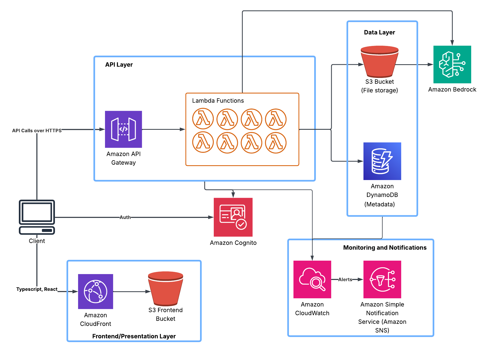

# Document Storage App

A secure, serverless document storage application built on AWS with AI-powered file analysis capabilities. Upload, manage, share, and analyze your documents with Claude AI integration via AWS Bedrock.

## Table of Contents

- [Overview](#overview)
- [Features](#features)
- [Architecture](#architecture)
- [AWS Services](#aws-services)
- [Tech Stack](#tech-stack)
- [Project Structure](#project-structure)
- [Architecture Diagrams](#architecture-diagrams)
- [Getting Started](#getting-started)
  - [Prerequisites](#prerequisites)
  - [Running Locally](#running-locally)
  - [Frontend Development](#frontend-development)
  - [Backend Development](#backend-development)
- [Deployment](#deployment)
- [API Endpoints](#api-endpoints)
- [Security](#security)
- [Monitoring](#monitoring)
- [Testing](#testing)

## Overview

This application provides a complete document management solution with secure authentication, file sharing capabilities, and AI-powered document analysis. Built using AWS serverless technologies, it scales automatically and only charges for actual usage.

## Features

- **Secure Authentication**: User authentication and authorization via AWS Cognito
- **File Management**: Upload, download, list, and delete files
- **File Sharing**: Generate shareable links with expiration times
- **AI Analysis**: Chat with your documents using Claude AI via AWS Bedrock
- **PDF Support**: Automatic text extraction from PDF files
- **MCP Protocol**: Implements Model Context Protocol for standardized AI interactions
- **Serverless Architecture**: Fully serverless with automatic scaling
- **Monitoring**: Comprehensive CloudWatch dashboards and alarms
- **Secure Storage**: Encrypted S3 storage with versioning enabled

## Architecture

The application follows a serverless microservices architecture:

```
┌─────────────────────────────────────────────────────────────┐
│                         USER / BROWSER                       │
└─────────────────────────────────────────────────────────────┘
                              │
                              ├──────────────────┐
                              ▼                  ▼
                    ┌──────────────┐   ┌──────────────────┐
                    │  CloudFront  │   │   API Gateway    │
                    │   (CDN)      │   │                  │
                    └──────────────┘   └──────────────────┘
                              │                  │
                              ▼                  ▼
                    ┌──────────────┐   ┌──────────────────┐
                    │  S3 Bucket   │   │  Lambda Functions│
                    │  (Frontend)  │   │  - upload_file   │
                    └──────────────┘   │  - download_file │
                                       │  - list_files    │
                    ┌──────────────┐   │  - delete_file   │
                    │ AWS Cognito  │   │  - share_file    │
                    │   (Auth)     │◄──┤  - shared_link   │
                    └──────────────┘   │  - mcp_handler   │
                                       │  - chat_handler  │
                                       └──────────────────┘
                                                 │
                                       ┌─────────┴─────────┐
                                       ▼                   ▼
                              ┌──────────────┐   ┌──────────────┐
                              │  DynamoDB    │   │  S3 Bucket   │
                              │  (Metadata)  │   │  (Files)     │
                              └──────────────┘   └──────────────┘
                                                         │
                                                         ▼
                                              ┌──────────────────┐
                                              │  AWS Bedrock     │
                                              │  (Claude AI)     │
                                              └──────────────────┘
```

## AWS Services

This application leverages the following AWS services:

| Service | Purpose |
|---------|---------|
| **Lambda** | Serverless compute for 8 backend functions (upload, download, list, delete, share, shared_link, mcp_handler, chat_handler) |
| **API Gateway** | RESTful API endpoints with Cognito authorization |
| **S3** | Three buckets: file storage, lambda deployment packages, and frontend hosting |
| **DynamoDB** | Two tables: file metadata and shared links (with TTL support) |
| **Cognito** | User authentication (User Pool, Identity Pool, User Pool Client) |
| **CloudFront** | CDN for frontend distribution with OAI security |
| **IAM** | Roles and policies for least-privilege access |
| **CloudWatch** | Metrics, logs, dashboards, and alarms |
| **SNS** | Alarm notifications |
| **Bedrock** | AI-powered document analysis using Claude 3.5 Haiku |

## Tech Stack

### Frontend
- **React** 19.2.0 - Modern UI library
- **TypeScript** 4.9.5 - Type-safe development
- **React Router DOM** 7.9.4 - Client-side routing
- **AWS Amplify** 6.15.7 - AWS service integration
- **AWS Amplify UI React** 6.13.0 - Pre-built authentication components
- **React Scripts** 5.0.1 - Create React App tooling

### Backend
- **Python** 3.9 - Runtime for Lambda functions
- **Poetry** - Dependency management
- **boto3** - AWS SDK for Python
- **PyPDF2** - PDF text extraction
- **pytest** - Testing framework
- **moto** - AWS service mocking for tests

### Infrastructure
- **AWS CloudFormation** - Infrastructure as Code
- **Bash** - Deployment scripts

## Project Structure

```
Document-Storage-App/
├── frontend/                 # React frontend application
│   ├── src/
│   │   ├── components/      # React components
│   │   ├── services/        # API service clients
│   │   ├── hooks/           # Custom React hooks
│   │   ├── types/           # TypeScript type definitions
│   │   ├── utils/           # Utility functions
│   │   ├── App.tsx          # Main application component
│   │   └── aws-exports.ts   # AWS Amplify configuration
│   ├── public/              # Static assets
│   └── package.json         # Frontend dependencies
│
├── backend/                  # Python Lambda functions
│   ├── lambda_functions/
│   │   ├── upload_file/     # Upload handler
│   │   ├── download_file/   # Download handler
│   │   ├── list_files/      # List files handler
│   │   ├── delete_file/     # Delete handler
│   │   ├── share_file/      # Share link generator
│   │   ├── shared_link/     # Public share access
│   │   ├── mcp_handler/     # MCP protocol handler
│   │   └── chat_handler/    # AI chat handler
│   ├── tests/               # Backend unit tests
│   ├── pyproject.toml       # Poetry dependencies
│   └── README.md            # Backend documentation
│
├── infrastructure/           # CloudFormation templates
│   ├── cloudformation/
│   │   ├── infrastructure.yml  # S3 & DynamoDB
│   │   ├── auth.yml           # Cognito setup
│   │   ├── backend.yml        # Lambdas & API Gateway
│   │   ├── frontend.yml       # CloudFront & S3 hosting
│   │   └── monitoring.yml     # CloudWatch & SNS
│   └── parameters/           # Stack parameters
│
├── scripts/                  # Deployment scripts
│   └── package-lambdas.sh   # Lambda packaging script
│
├── docs/                     # Documentation
│   ├── architecture.md      # Architecture details
│   ├── database-schema.md   # DynamoDB schema
│   ├── DEPLOYMENT.md        # Deployment guide
│   └── monitoring.md        # Monitoring setup
```

## Architecture Diagrams

### AWS Architecture



### File Upload Flow
```
User → Cognito Auth → API Gateway → upload_file Lambda
                                         │
                                         ├──→ Generate S3 pre-signed URL
                                         │
                                         ├──→ Store metadata in DynamoDB
                                         │
                                         └──→ Return upload URL to user
                                               │
User ──────────────────────────────────────────┘
      (Direct upload to S3)
```

### AI Analysis Flow
```
User → API Gateway → chat_handler Lambda
                          │
                          ├──→ Invoke mcp_handler Lambda
                          │      │
                          │      ├──→ Query DynamoDB (userId + fileId)
                          │      │
                          │      └──→ Fetch from S3 & extract text
                          │
                          ├──→ Receive file content
                          │
                          └──→ AWS Bedrock (Claude 3.5 Haiku)
                                   │
                                   └──→ Generate AI response → User
```

### Database Schema

**Files Table** (`files-{env}`)
- Partition Key: `userId` (String)
- Sort Key: `fileId` (String)
- Attributes: `fileName`, `fileSize`, `fileType`, `s3Key`, `uploadDate`, `sharedWith`
- GSI: `fileId-index` for lookups by fileId

**Shared Links Table** (`SharedLinksTable-{env}`)
- Partition Key: `shareToken` (String)
- Attributes: `fileId`, `userId`, `expiresAt`, `createdAt`
- TTL: Enabled on `expiresAt` attribute

## Getting Started

### Prerequisites

- **Node.js** 16+ and npm
- **Python** 3.9
- **Poetry** (for Python dependency management)
- **AWS CLI** configured with appropriate credentials
- **AWS Account** with permissions for:
  - Lambda, API Gateway, S3, DynamoDB, Cognito
  - CloudFormation, CloudFront, IAM
  - Bedrock (Claude model access)

### Running Locally

#### Frontend Development

1. Navigate to the frontend directory:
   ```bash
   cd frontend
   ```

2. Install dependencies:
   ```bash
   npm install
   ```

3. Configure AWS Amplify:
   - Update `src/aws-exports.ts` with your Cognito User Pool and Identity Pool IDs
   - Or set environment variables for your AWS resources

4. Start the development server:
   ```bash
   npm start
   ```

5. The application will open at [http://localhost:3000](http://localhost:3000)

**Available Scripts:**
- `npm start` - Runs development server
- `npm test` - Runs test suite
- `npm run build` - Creates production build
- `npm run eject` - Ejects from Create React App (one-way operation)

#### Backend Development

1. Navigate to the backend directory:
   ```bash
   cd backend
   ```

2. Install Poetry (if not already installed):
   ```bash
   curl -sSL https://install.python-poetry.org | python3 -
   ```

3. Configure Poetry to use Python 3.9:
   ```bash
   poetry env use python3.9
   ```

4. Install dependencies:
   ```bash
   poetry install
   ```

5. Activate the virtual environment:
   ```bash
   poetry shell
   # or
   source $(poetry env info --path)/bin/activate
   ```

6. Verify Python version:
   ```bash
   python --version
   # Expected: Python 3.9.x
   ```

7. Run tests:
   ```bash
   pytest
   ```

**Local Lambda Testing:**
- Use SAM CLI or LocalStack for local Lambda testing
- Mock AWS services using `moto` for unit tests
- See `backend/tests/` for test examples

## Deployment

For complete deployment instructions, see [docs/DEPLOYMENT.md](docs/DEPLOYMENT.md).

**Quick Deployment Steps:**

1. **Package Lambda Functions:**
   ```bash
   ./scripts/package-lambdas.sh
   ```

2. **Deploy Infrastructure Stack:**
   ```bash
   aws cloudformation deploy \
     --template-file infrastructure/cloudformation/infrastructure.yml \
     --stack-name file-storage-dev-infrastructure \
     --parameter-overrides Environment=dev \
     --capabilities CAPABILITY_NAMED_IAM
   ```

3. **Deploy Auth Stack:**
   ```bash
   aws cloudformation deploy \
     --template-file infrastructure/cloudformation/auth.yml \
     --stack-name file-storage-dev-auth \
     --parameter-overrides Environment=dev \
     --capabilities CAPABILITY_NAMED_IAM
   ```

4. **Deploy Backend Stack:**
   ```bash
   aws cloudformation deploy \
     --template-file infrastructure/cloudformation/backend.yml \
     --stack-name file-storage-dev-backend \
     --parameter-overrides Environment=dev \
     --capabilities CAPABILITY_NAMED_IAM
   ```

5. **Deploy Frontend:**
   ```bash
   cd frontend
   npm run build
   aws s3 sync build/ s3://your-frontend-bucket/
   aws cloudfront create-invalidation --distribution-id YOUR_DIST_ID --paths "/*"
   ```

## API Endpoints

All endpoints require authentication via Cognito JWT tokens (except shared links).

| Method | Endpoint | Description | Auth Required |
|--------|----------|-------------|---------------|
| POST | `/files` | Upload a file | Yes |
| GET | `/files` | List user's files | Yes |
| GET | `/files/{fileId}` | Download a file | Yes |
| DELETE | `/files/{fileId}` | Delete a file | Yes |
| POST | `/files/{fileId}/share` | Generate share link | Yes |
| GET | `/shared/{linkId}` | Access shared file | No |
| POST | `/mcp` | MCP protocol endpoint | Yes |
| POST | `/chat` | AI chat with documents | Yes |

**Authentication Header:**
```
Authorization: Bearer <cognito-id-token>
```

## Security

- **Authentication**: AWS Cognito with JWT tokens
- **Authorization**: API Gateway Cognito authorizers
- **Encryption**:
  - S3 server-side encryption (AES256)
  - HTTPS/TLS for all API calls
  - CloudFront with redirect-to-https policy
- **Access Control**:
  - IAM roles with least-privilege policies
  - Private S3 buckets with OAI for CloudFront
  - User isolation at DynamoDB partition key level
- **Token Expiry**:
  - ID tokens: 1 hour
  - Refresh tokens: 30 days
  - Share links: Configurable TTL via DynamoDB
- **CORS**: Configured for secure cross-origin requests

## Monitoring

The application includes comprehensive monitoring:

- **CloudWatch Dashboard**: Real-time metrics for Lambda, API Gateway, and DynamoDB
- **CloudWatch Alarms**:
  - Lambda error rates
  - API Gateway 5xx errors
  - High latency warnings
- **SNS Notifications**: Alarm notifications via email/SMS
- **Lambda Logs**: Detailed CloudWatch Logs for debugging
- **X-Ray Tracing**: (Optional) Distributed tracing for requests

View monitoring setup: [docs/monitoring.md](docs/monitoring.md)

## Testing

### Frontend Tests
```bash
cd frontend
npm test
```

### Backend Tests
```bash
cd backend
poetry shell
pytest
```

**Test Coverage:**
- Unit tests for Lambda functions using `pytest`
- AWS service mocking with `moto`
- React component tests with React Testing Library